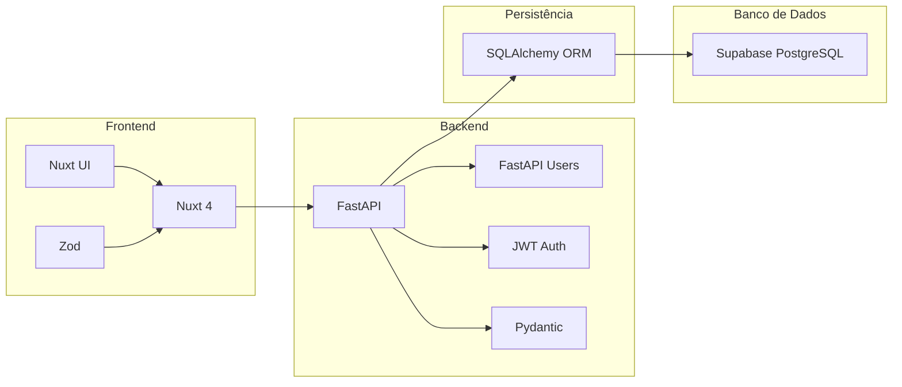
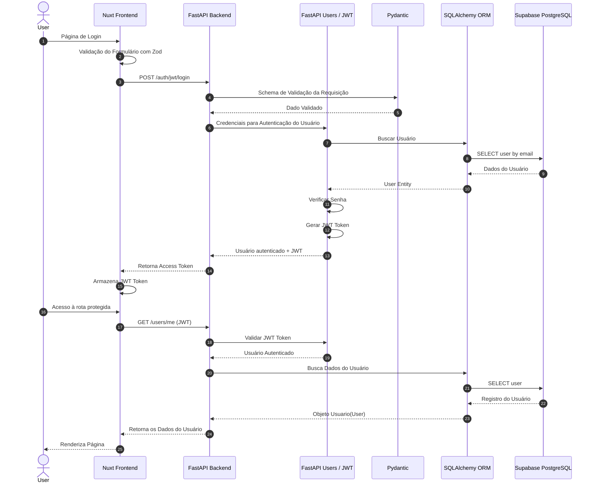

# Módulo de Autenticação

Sistema full stack para autenticação e gerenciamento de usuários utilizando FastAPI no backend e Nuxt 4 no frontend, com autenticação JWT, integração com Supabase e arquitetura moderna baseada em APIs.

---

## 1 - Tecnologias Utilizadas

### 1.1 - Backend
- Python 3.13
- FastAPI
- FastAPI Users
- SQLAlchemy
- JWT Authentication
- Async/Await
- PostgreSQL
- Supabase
- Resend
- Pydantic 

### 1.2 - Frontend
- Nuxt 4.4.4
- Nuxt UI 4.7.1
- Zod 4.4.3
- TypeScript

---

# 2 - Sobre o Projeto

Este projeto foi desenvolvido com o objetivo de fornecer uma estrutura moderna e escalável para autenticação e gerenciamento de usuários.

A aplicação implementa:

- Gerenciamento de usuários
- Login com JWT
- Autenticação baseada em tokens
- Recuperação de senha
- Verificação de e-mail
- Integração entre frontend e backend
- API assíncrona utilizando FastAPI
- Persistência de dados com Supabase/PostgreSQL

O sistema foi construído seguindo boas práticas de arquitetura backend e frontend, utilizando validação tipada, autenticação segura e comunicação desacoplada via API REST.

---

# 3 - Arquitetura



---

# 4 - Diagrama de Sequência do login e do acesso às rotas protegidas.



---

# 5 - Funcionalidades

## 5.1 - Autenticação
- Login
- Logout
- Autenticação JWT
- Refresh Token
- Proteção de rotas

## 5.2 - Usuários
- Cadastro de usuários
- Edição de perfil
- Exclusão de perfil
- Consulta de perfil


## 5.3 - Segurança
- Hash de senhas
- Tokens JWT
- Validação de dados
- Verificação de e-mail
- Recuperação de senha

---


# 6 - Principais Tecnologias

## 6.1 - Backend

| Tecnologia | Função |
|---|---|
| FastAPI | API REST assíncrona |
| FastAPI Users | Sistema de autenticação |
| Pydantic | Schemas para validação de dados da requisição|
| SQLAlchemy | ORM |
| JWT | Autenticação |
| Supabase | Banco de dados PostgreSQL |

---

## 6.2 - Frontend

| Tecnologia | Função |
|---|---|
| Nuxt 4 | Framework frontend |
| Nuxt UI | Componentes de interface |
| Zod | Validação de schemas |
| TypeScript | Tipagem estática |

---

# 7 - Estrutura do Projeto

```text
auth/
│
├── backend/
│   │
│   ├── .venv/                 # Virtual environment
│   ├── app/                   # FastAPI application
│   │   ├── routes/            # API routes
│   │   │   ├── auth.py        # Rotas para autenticação.
│   │   │   ├── user.py        # Rotas para regrenciamento do usuário.
│   │   ├── schemas/           # Pydantic schemas
│   │   │   ├── user.py        # Schema pydantic do usuário.
│   │   ├── models/            # Modelos do SQLAlchemy
│   │   │   ├── base.py        # Modelo base a ser importado por todos os modelos.
│   │   │   ├── user.py        # Modelo do usuário criado pelo FastApi Users com algumas modificações.
│   │   ├── services/          # Regra de negócio e serviços
│   │   │   ├── email.py       # Código para tratamento de emails de confirmação com resend.
│   │   ├── auth/              # Configuração do sistema de autenticação.
│   │   │   ├── user.py        # Configuração central do sistema de autenticação e gerenciamento de usuários utilizando FastAPI Users, JWT, SQLAlchemy assíncrono e PostgreSQL.
│   │   ├── static/            # Imagens e etc.
│   │   ├── db.py              # Configuração do Banco de Dados
│   │   ├── create_db.py       # Criação do Banco de Dados
│   │   ├── config.py          # Schema pydantic para as variáveis de ambiente
│   │   └── main.py            # FastAPI entrypoint
│   │
│   ├── requirements.txt       # Python dependencies
│   └── README.md
│
├── frontend/
│   │
│   ├── pages/                 # Application pages
│   ├── components/            # Reusable UI components
│   ├── composables/           # Vue/Nuxt composables
│   ├── middleware/            # Route middleware
│   ├── public/                # Static assets
│   ├── app.vue                # Root component
│   ├── nuxt.config.ts         # Nuxt configuration
│   └── package.json           # Node dependencies
│
├── .gitignore
└── README.md
```

---

# 8 - Como Executar o Projeto

## 8.1 - Backend

### Instalar dependências

```bash
pip install -r requirements.txt
```

### Executar servidor

```bash
uvicorn app.main:app --reload
```

---

## 8.2 - Frontend

### Instalar dependências

```bash
npm install
```

### Executar aplicação

```bash
npm run dev
```

---

# 9 - Variáveis de Ambiente

## 9.1 - Backend

```env
DATABASE_URL=
SECRET=
SUPABASE_URL=
SUPABASE_KEY=
RESEND_API_KEY=
```

## 9.2 - Frontend

```env
NUXT_PUBLIC_API_URL=
```

---

# 10 - Endpoints Principais

## 10.1 - Autenticação (FastApi Users)

```http
POST /auth/register                # Rota para cadastro de usuários
POST /auth/jwt/login               # Rota para login
POST /auth/jwt/logout              # Rota para logout
POST /auth/forgot-password         # Inicia o processo de recuperação de senha enviando um token de redefinição para o e-mail do usuário.
POST /auth/reset-password          # Valida o token de recuperação recebido e define uma nova senha para o usuário.
POST /auth/verify-request-token    # Solicita o envio do token de verificação de e-mail para confirmação da conta do usuário após o cadastro.
POST /auth/verify                  # Valida o token de verificação e confirma o e-mail do usuário, marcando a conta como verificada.
```
## 10.2 - Usuários (FastApi Users)

```http
PATCH /users/me                    # Atualiza os dados do usuário atualmente autenticado.
GET /users/{id}                    # Retorna os dados de um usuário específico através do ID.
PATCH /users/{id}                  # Atualiza os dados de um usuário específico através do ID.
DELETE /users/{id}                 # Remove um usuário específico do sistema através do ID.

```
## 10.3 - Customizadas

```http
GET /users/me                      # Retorna os dados completos do usuário autenticado atualmente.
GET /users/by-email/{email}        # Busca e retorna um usuário específico através do endereço de e-mail.
DELETE /users/by-email/{email}     # Remove um usuário do sistema utilizando o endereço de e-mail.
```
---

# 11 - Objetivos do Projeto

- Estudo de arquitetura full stack moderna 
- Implementação de autenticação segura utilizando tokens JWT
- Integração entre backend Python (FastApi) e frontend Vue (Nuxt 4)
- Utilização de APIs assíncronas
- Aplicação de boas práticas de desenvolvimento (OO, ORM e Injeção de Dependência)

---

# 12 - Melhorias Futuras

- Refresh token seguro com cookies HTTPOnly
- Controle de permissões (RBAC)
- Dockerização
- Deploy em cloud
- Testes automatizados
- OAuth2 (Google/GitHub)
- Painel administrativo

---

# 13 - Boas Práticas e Conceitos Aplicados

- Arquitetura separada entre frontend e backend
- Organização modular por responsabilidades
- Validação de dados com Pydantic e Zod
- Autenticação segura com JWT
- Gerenciamento de usuários com FastAPI Users
- Uso de variáveis de ambiente com `.env`
- ORM com SQLAlchemy para abstração do banco de dados
- Banco PostgreSQL relacional via Supabase
- Sessões assíncronas com Async SQLAlchemy
- Padronização de schemas de entrada e saída
- Separação entre regras de negócio, rotas e persistência
- Sistema de verificação de e-mail
- Sistema de recuperação de senha
- Middleware de autenticação no frontend
- Componentização da interface com Nuxt UI
- Estrutura preparada para escalabilidade
- Documentação automática da API com Swagger/OpenAPI
- Utilização de tipagem forte com Type Hints
- Uso de Git e GitHub para versionamento
- Uso de Orientação a Objetos
- Configuração de arquivos sensíveis via `.gitignore`

---

## 14 - Padrões de Projeto Aplicados

- Layered Architecture
  Separação da aplicação em frontend, backend, serviços e persistência.

- Dependency Injection
  Utilização do sistema de dependências do FastAPI através do `Depends()`.

- Repository Pattern
  Abstração do acesso ao banco de dados utilizando SQLAlchemy e FastAPI Users.

- Service Layer Pattern
  Separação das regras de negócio em serviços dedicados.

- DTO (Data Transfer Object)
  Uso de schemas Pydantic para transferência e validação de dados.

- Factory Pattern
  Criação de sessões e estratégias JWT através de funções/factories.

- Singleton Pattern
  Configuração centralizada da aplicação e instâncias compartilhadas.

- Middleware Pattern
  Interceptação de requisições e autenticação via middleware/backend JWT.

- ORM Pattern
  Mapeamento objeto-relacional utilizando SQLAlchemy.

- RESTful API Design
  Organização das rotas seguindo princípios REST.
---

# 15 - Licença

Este projeto está sob a licença MIT.

---

# 16 - Autor

Rodrigo Costa

GitHub: https://github.com/rmcfdma
